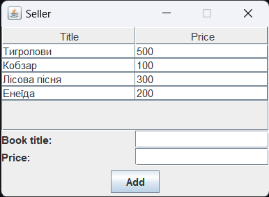
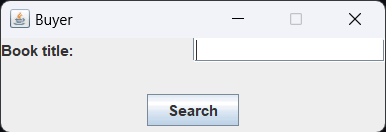
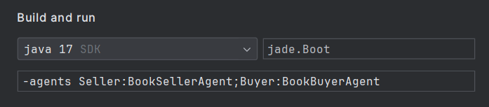

### Uglik Rostislav

### ЗВІТ

У данній лабораторній роботі було розробленно систему для продажі книг, за допомогою Агентів JADE.
1) Було створенно агента-продавця, якому при запуску додавались захардкоджені книги (їх можна додати через інтерфейс).
 Цей агент має циклічну поведінку, яка слухає всі вхідні повідомлення
2) Потім було створенно агента-покупця, якому теж було задано циклічну поведінку прослуховування повідомлень.
3) Також було розробленно інтерфейс для покупця та дороблений інтерфейс для продавця.
4) Коли покупець в інтерфейсі натискає кнопку Пошуку, агент виконує OneShot поведінку, надсилаючи повідомлення продавцю з назвою книги.
 Якщо така книга існує форма оновлується і кнопка Пошуку стає кнопкою підтвердження покупки. Після покупки книга видаляється з массиву продавця.

#### Проблеми з якими я зіштохнувся
Було дуже багато проблема, починаючи з того, що я ніколи не програмував на Java, але досвід у інших мовах программування, а найбільше у C#, допоміг мені швидко її освоїти.

Наступною проблемою стало неможливість запустити JADE. Я дуже довго намагався це зробити, але все ж таки прийшлось скачати IntelegIDEA і Java минулої версії.

Далі я виконав завдання згідно з Туторіалом, але мені так сподобалось, що я вирішив доробити проєкт до user-friendly вигляду. І доробив інтерфейс продавця і розробив власний інтерфейс покупця. 
З ним у мене було дуже багато проблем стосовно розположення елементів, бо я звик до TKinter у Python та HTML, де елементи просто додаються вниз, а тут була якась дуже складна система у фрейворка Swing.

Наступною проблемою інтерфейсу стало те, що коли я закривав вікно інтерфейсу агент викликав Exception при вимиканні. Розібравшись я зрозумів, що я викликав знову команду dispose(), коли вікно вже було закрито. Тому я вирішив закоментовути цей виклик.

#### Підсумки
Взагалом JADE це прикольна бібліотека, але писати на ній якийсь великий проєкт я б не став. =)

#### Run

`java -cp jade.jar jade.Boot -gui -agents Seller:BookSellerAgent;Buyer:BookBuyerAgent`

